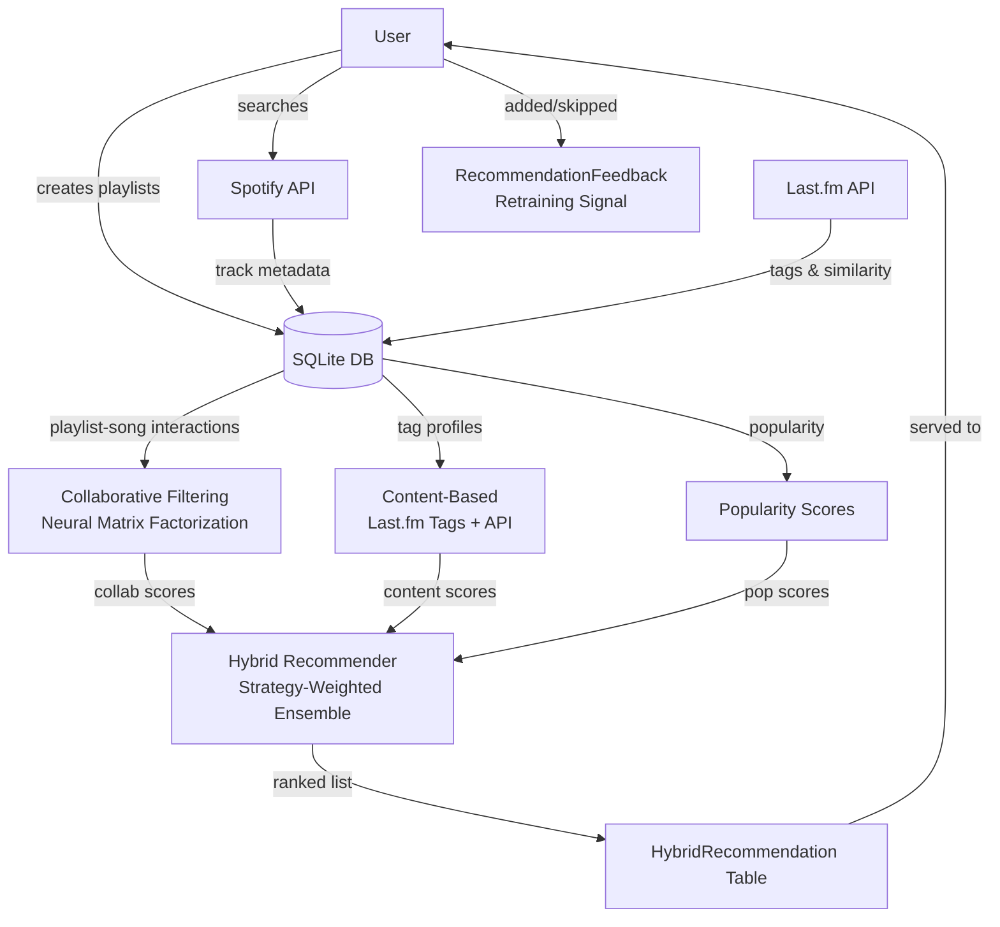

# Music Recommendation System

A Django-based music platform with a **hybrid ML recommendation engine** that combines neural collaborative filtering (TensorFlow), content-based filtering (Last.fm tags), and a strategy-weighted ensemble. Built as a thesis project demonstrating full-stack ML integration.

[](https://www.python.org/)
[](https://www.djangoproject.com/)
[](https://www.tensorflow.org/)
[](#testing)
[](../../actions)

---

## Architecture



---

## ML Pipeline

The recommendation engine has three layers — see [docs/ML_PIPELINE.md](docs/ML_PIPELINE.md) for full details.

### 1. Neural Collaborative Filtering
Learns latent representations of playlists and songs from implicit feedback (which songs a playlist contains). Uses negative sampling (4:1) and binary cross-entropy loss — the correct objective for implicit feedback.

```
Playlist Embedding (50d) ──┐
                            ├─ Dot Product + Bias ──→ Sigmoid ──→ P(interaction)
Song Embedding (50d) ──────┘
```

Evaluated with **Precision@K**, **Recall@K**, **NDCG@K** on a 20% held-out split.

### 2. Content-Based Filtering (Last.fm)
Builds a tag profile from playlist songs, then scores candidates by weighted tag similarity. Also calls `track.getSimilar` for API-based similarity. The two signals are combined 60/40.

### 3. Hybrid Ensemble with Strategy Selection

| Component | balanced | discovery | popular |
|-----------|----------|-----------|---------|
| Collaborative | 40% | 20% | 10% |
| Content tags | 30% | **50%** | 20% |
| Content similar | 20% | 20% | 10% |
| Popularity | 10% | 10% | **60%** |

---

## Tech Stack

| Technology | Purpose | Why |
|------------|---------|-----|
| **Django 5.1.6** | Web framework | Thesis requirement; batteries-included admin, ORM, auth |
| **TensorFlow 2.x** | Collaborative filtering | Neural embeddings; demonstrates ML framework integration |
| **Spotipy** | Spotify API client | Search, track metadata, OAuth playlist import |
| **Requests** | Last.fm API | Tag enrichment, similar-track lookup |
| **SQLite** | Development DB | Zero-config; production would use PostgreSQL |
| **Django cache framework** | Recommendation caching | 30-min TTL prevents repeated ML inference |

---

## Features

- **Personalised recommendations** with three selectable strategies (balanced / discovery / popular)
- **Recommendation explanations** — per-card breakdown of what drove each suggestion
- **Spotify integration** — search 100M+ songs, import playlists via OAuth
- **Last.fm enrichment** — automatic tag and metadata enrichment for every song
- **Social platform** — follow users, share playlists, comment, direct messages
- **Activity feed** — see what followed users are listening to
- **User profiles** with profile picture upload

---

## Project Structure

```
zavrsni/
├── accounts/               # Auth, registration, user profiles
├── music/                  # Song & Playlist models, search, CRUD
├── recommendations/        # ML engine
│   ├── collaborative_recommender.py   # Neural matrix factorization (TF)
│   ├── content_recommender.py         # Last.fm tag + API similarity
│   ├── hybrid_recommender.py          # Weighted ensemble, 3 strategies
│   ├── evaluation.py                  # Offline metrics (coverage, bias, NDCG)
│   └── management/commands/           # train, enrich, evaluate, update
├── spotify/                # OAuth flow, playlist import, API wrapper
├── lastfm/                 # Tag enrichment, similarity, retry logic
├── social/                 # Follow, messaging, feed, comments
├── static/                 # CSS + JS (recommendations.js, song-search.js, ...)
├── templates/              # Global templates (base.html, index.html)
└── docs/
    └── ML_PIPELINE.md      # Detailed ML architecture documentation
```

---

## Getting Started

### Prerequisites

```
Python 3.11+
Spotify Developer account (free) — for SPOTIFY_CLIENT_ID / SECRET
Last.fm API key (free) — for LASTFM_API_KEY
```

### Installation

```bash
git clone https://github.com/yourusername/music-recommendation-system.git
cd music-recommendation-system/zavrsni

python -m venv venv
source venv/bin/activate          # Windows: venv\Scripts\activate
pip install -r requirements.txt
```

### Environment Variables

Copy `.env.example` and fill in your keys:

```bash
cp .env.example .env
```

```ini
SECRET_KEY=your-django-secret-key-here
DEBUG=True
SPOTIFY_CLIENT_ID=your-spotify-client-id
SPOTIFY_CLIENT_SECRET=your-spotify-client-secret
LASTFM_API_KEY=your-lastfm-api-key
```

Get API keys:
- Spotify: [developer.spotify.com/dashboard](https://developer.spotify.com/dashboard) → Create App → Client ID + Secret
- Last.fm: [last.fm/api/account/create](https://www.last.fm/api/account/create) → API Key

### Database & Run

```bash
python manage.py migrate
python manage.py runserver
```

Open [http://localhost:8000](http://localhost:8000)

### Docker

```bash
docker-compose up --build
```

---

## Management Commands

```bash
# Enrich songs already in DB with Last.fm tags and metadata
python manage.py enrich_songs_lastfm --batch-size 50

# Train the collaborative filtering model
python manage.py train_recommendations

# Regenerate recommendations for all playlists
python manage.py update_recommendations --strategy balanced

# Run offline evaluation (fast — uses existing DB)
python manage.py evaluate_model

# Run ranking evaluation (slow — retrains model with hold-out)
python manage.py evaluate_model --retrain --k 10
```

Or use the Makefile shortcuts:

```bash
make run        # start dev server
make test       # run all tests with coverage
make lint       # ruff check
make train      # train collaborative model
make enrich     # enrich songs with Last.fm
make evaluate   # run offline evaluation
```

---

## Testing

```bash
# Run all tests
make test
# or: pytest --tb=short -q

# With coverage report
pytest --cov=. --cov-report=term-missing
```

**135 tests across all apps**, covering:

| App | Tests | Coverage focus |
|-----|-------|----------------|
| `recommendations/` | 44 | Collaborative, content, hybrid recommenders |
| `social/` | 35 | Follow, messaging, comments, feed, model methods |
| `lastfm/` | 25 | API wrapper with mocked HTTP, tag normalization |
| `spotify/` | 20 | Search, audio features, song creation |
| `music/` | 14 | Playlist CRUD, models |

All external APIs (Spotify, Last.fm) are mocked — no network calls in tests.

---

## Key API Endpoints

| Method | URL | Description |
|--------|-----|-------------|
| `GET` | `/playlists/` | List user playlists |
| `POST` | `/playlists/create/` | Create playlist |
| `GET` | `/playlists/<id>/` | Playlist detail + recommendations |
| `POST` | `/playlists/<id>/recommendations/refresh/` | Force-refresh recommendations |
| `POST` | `/playlists/<id>/recommendations/add/` | Add recommended song to playlist |
| `GET` | `/music/search/?query=` | Search Spotify (JSON) |
| `POST` | `/playlists/<id>/add/` | Add song to playlist (AJAX) |
| `GET` | `/social/feed/` | Activity feed |
| `POST` | `/social/follow/<username>/` | Follow/unfollow user |
| `GET` | `/social/messages/` | List conversations |
| `POST` | `/social/messages/send/` | Send message |

---

## Intentional Technical Decisions

These are thesis scope decisions, not oversights:

- **SQLite** — zero-config for demo; swap `DATABASES` for PostgreSQL in production
- **TensorFlow for NCF** — demonstrates ML integration even though scikit-learn NMF is simpler; the complexity is the point for a thesis showcase
- **AJAX polling for messages** — simpler than WebSockets for thesis scope; a production version would use Django Channels
- **Spotipy client credentials flow** — song search works without user auth; OAuth is only required for playlist import
- **Croatian UI** — the platform targets Croatian-speaking users; all code, docs, and comments are in English

---

## License

MIT
